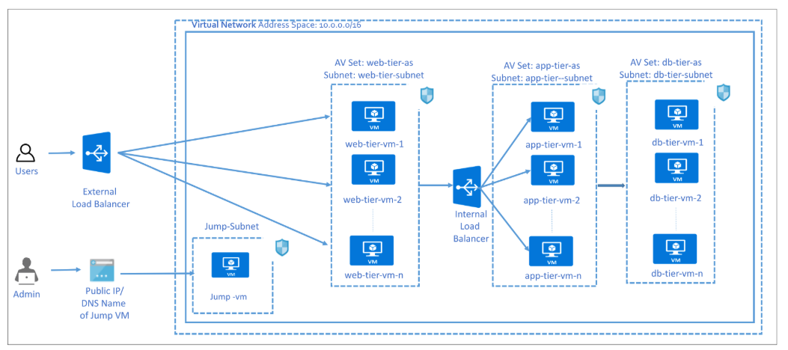

# Azure Three-Tier Web App with Terraform

A secure, production-ready three-tier web infrastructure deployed on Microsoft Azure using Terraform. This project provisions a highly available NGINX web server behind a Standard Load Balancer, with isolated subnets for web, application, and database layers, plus secure admin access via Azure Bastion.



---

## Features

- Public HTTP access via Azure Standard Load Balancer
- Secure SSH access using Azure Bastion
- Isolated subnets for web, app, and DB tiers
- Outbound internet access via NAT Gateway (for OS updates & package installs)
- Least-privilege NSG rules (only necessary traffic allowed)
- Automated NGINX deployment via cloud-init (`setup.sh`)
- Fully idempotent: Infrastructure-as-Code with Terraform

---

## Prerequisites

- [Azure CLI](https://learn.microsoft.com/en-us/cli/azure/install-azure-cli) installed and logged in (`az login`)
- [Terraform](https://www.terraform.io/downloads) v1.0+
- An Azure subscription

---

## 🚀 Deployment

1. Clone this repository:
   ```bash
   git clone https://github.com/omiete01/three_tier_azure.git
   cd three_tier_azure.git
   ```

2. Initialize Terraform:
   ```bash
   terraform init
   ```

3. Validate Terraform:
   ```bash
   terraform validate
   ```

4. Review the execution plan:
   ```bash
   terraform plan
   ```

5. Apply the configuration:
   ```bash
   terraform apply
   ```

6. After deployment, note the public IP output:
   
   Outputs:
     public_ip_address = "20.193.XX.XX"
   

7. Visit `http://<public_ip_address>` in your browser — you should see the **NGINX welcome page**.

8. To SSH into the VM securely:
   - Go to the Azure Portal
   - Navigate to the VM `web-nginx-vm`
   - Click **Connect → Bastion**
   - Use username: `azureuser`, password: `P@ssword1234!`

---

## Project Structure

```
.
├── main.tf              # Core infrastructure (VNet, subnets, VM, LB, Bastion, NAT Gateway)
├── setup.sh             # Cloud-init script to install and start NGINX
└── README.md            # This file
```

---

## Cleanup

To avoid Azure charges, destroy all resources when done:
```bash
terraform destroy
```

---
